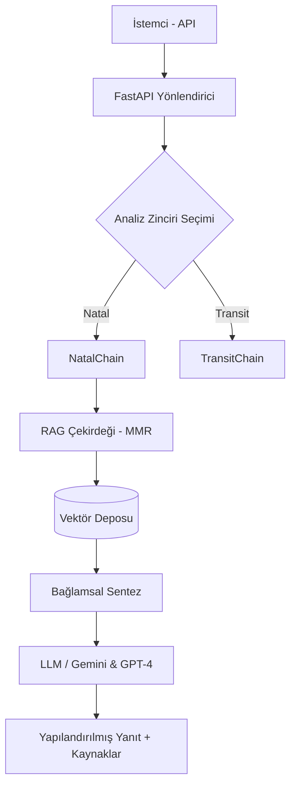

# 🪐 Astro-Oracle: Otonom Gökyüzü Yorumlama Motoru 2.0

[](https://opensource.org/licenses/MIT)
[](https://www.python.org/)
[](https://fastapi.tiangolo.com/)
[](https://www.docker.com/)
[](https://github.com/arch-yunus/Astro-Oracle/actions/workflows/ci.yml)

**Astro-Oracle 2.0**, çok katmanlı **Geri Getirme Artırımlı Üretim (RAG)** mimarisi ve modüler **Muhakeme Zincirleri (Reasoning Chains)** ile güçlendirilmiş, kurumsal düzeyde otonom bir gökyüzü analiz motorudur.

---

## 🏗️ Gelişmiş Mimari (V2)

Astro-Oracle 2.0, karmaşık gökyüzü verilerini işlemek için modüler bir yapı sunar.

### Uygulama Bileşenleri
- **`app/models/`**: Pydantic tabanlı katı veri şemaları ve tip denetimi.
- **`app/chains/`**: Uzmanlaşmış analiz mantığı (Natal, Transit, Sinastri).
- **`app/rag_engine.py`**: MMR (Max Marginal Relevance) arama ve kaynak takibi özellikli RAG çekirdeği.
- **`app/core/constants.py`**: Merkezi istem (Prompt) yönetimi ve astrolojik sabitler.



---

## 🔬 Yenilikler

- **MMR Arama Çeşitliliği**: Arama sonuçlarında benzerlik yerine çeşitliliğe odaklanarak daha zengin yorumlar üretir.
- **Otomatik Kaynak Takibi (Citations)**: Üretilen her yorumun hangi tarihi metinlerden beslendiğini metadata olarak raporlar.
- **Konteyner Desteği**: Docker ve Docker-Compose ile izole, ölçeklenebilir dağıtım.
- **CI/CD Entegrasyonu**: GitHub Actions ile otomatik linting ve sözdizimi doğrulaması.

---

## 🐳 Dağıtım ve Çalıştırma

### Docker ile (Önerilen)
Proyeyi saniyeler içinde ayağa kaldırın:
```bash
docker-compose up --build
```

### Manuel Kurulum
```bash
git clone https://github.com/arch-yunus/astro-oracle.git
cd astro-oracle
pip install -r requirements.txt
uvicorn app.main:app --reload
```

---

## 🛰️ API Referansı

### Natal Analiz
`POST /api/v1/interpret/natal`
*Doğum haritasını modüler zincir üzerinden derinlemesine analiz eder.*

### Sistem Sağlık Kontrolü
`GET /api/v1/health`
*Motor durumunu ve versiyon bilgisini döner.*

### Ham RAG Sorgusu
`POST /api/v1/query?query=...`
*Vektör deposu üzerinde doğrudan semantik arama yapar.*

---

## 🗺️ Stratejik Yol Haritası

- [x] **V1**: Temel RAG ve Vektör Veritabanı.
- [x] **V2**: Modüler Zincirler, Docker Desteği ve Kaynak Takibi.
- [ ] **V3**: Gerçek Zamanlı Gökyüzü Efemeris Entegrasyonu.
- [ ] **V4**: Çoklu Dil Desteği Geliştirmeleri ve Dinamik Dashboard.

---

## 🛡️ Lisans

**MIT Lisansı** altında dağıtılmaktadır. Copyright (c) 2026 **Astro-Oracle**.
