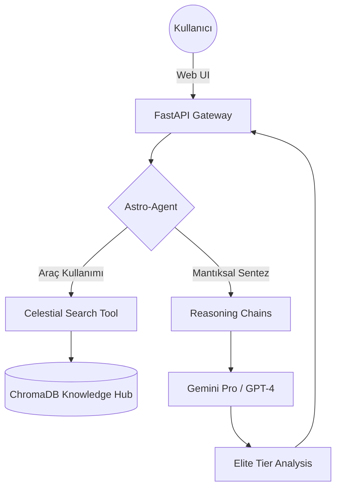

# 🪐 Astro-Oracle 3.0: Elite Celestial Intelligence Hub

[](https://opensource.org/licenses/MIT)
[](https://www.python.org/)
[](https://fastapi.tiangolo.com/)
[](https://www.docker.com/)
[]()

**Astro-Oracle 3.0**, kadim gökyüzü bilgeliğini otonom yapay zeka ajanları ve modüler RAG mimarisi ile birleştiren dünyanın en gelişmiş **Gök Bilimi Muhakeme Ekosistemi**'dir. Bu sistem, sadece veri yorumlamakla kalmaz; yıldızların dilini stratejik birer karar destek mekanizmasına dönüştürür.

---

## 🏛️ Üst Düzey Mimari (V3 Elite)

Astro-Oracle 3.0, çok katmanlı bir zeka katmanı sunarak karmaşık celestial (göksel) problemleri otonom olarak çözer.

### 🤖 Astro-Agent (Otonom Ajan)
Sistem merkezinde yer alan **Astro-Agent**, LangChain tabanlı otonom bir akıl yürütme motorudur. Kendi araçlarını (Tools) kullanarak çok adımlı analizler yapabilir:
- **Celestial Search**: Vektör veritabanında semantik derin arama.
- **Metadata Analytics**: Gezegen konumları ve teknik sembolojilerin analizi.

### 🌌 Elite Uygulama Katmanları
- **`app/agents/`**: Otonom muhakeme ve araç entegrasyonu.
- **`app/chains/`**: Uzmanlaşmış analiz hatları (Natal, Sinastri, Transit).
- **`frontend/`**: Glassmorphic UI/UX tasarımına sahip entegre web arayüzü.



---

## 🔬 Elit Özellikler

- **💎 Glassmorphic Web Arayüzü**: Gökyüzü estetiğiyle tasarlanmış, derin uzay animasyonlarına sahip interaktif kontrol paneli.
- **🚀 Otonom Muhakeme**: "Kariyerimdeki engelleri Sun/Saturn karesi ışığında analiz et" gibi kompleks soruları adım adım çözer.
- **📜 Bilgi Besleme Sentezi**: Antik Türk astronomisi, Helenistik teknikler ve Vedik bilgeliğin hibrit RAG sentezi.
- **🏗️ Tam Otomasyon**: `Makefile` ve `docker-compose` ile tek komutla kurulum ve yönetim.

---

## 🛠️ Kurulum ve Otomasyon

Elite Hub'ı hemen ayağa kaldırmak için:

```bash
# 1. Depoyu kurun ve verileri besleyin
make install
make seed

# 2. Docker ile tüm stack'i başlatın (Önerilen)
make docker-run

# Alternatif: Manuel çalıştırma
make run
```
*Arayüz adresi:* `http://localhost:8000/gui`

---

## 🛰️ API Ekosistemi

| Uç Nokta | Fonksiyon |
| :--- | :--- |
| `POST /api/v1/agent/query` | **Otonom Ajan** ile sınırsız muhakeme. |
| `POST /api/v1/interpret/natal` | Gelişmiş Natal harita sentezi. |
| `GET /gui` | **Elite Celestial Interface** (Web Arayüzü). |
| `GET /api/v1/health` | Sistem sağlık ve motor denetimi. |

---

## 🗺️ Stratejik Yol Haritası (Final)

- [x] **V1**: RAG Altyapısı.
- [x] **V2**: Modüler Zincirler ve Docker.
- [x] **V3**: **Otonom Ajanlar ve Elite Web Arayüzü.** ✨
- [ ] **V4**: Çok Kanallı Yayın (Discord/Telegram) ve Gerçek Zamanlı Gök Günlüğü.

---

## 🛡️ Lisans

**MIT Lisansı** altında dağıtılmaktadır. Copyright (c) 2026 **Astro-Oracle Elite Team**.
