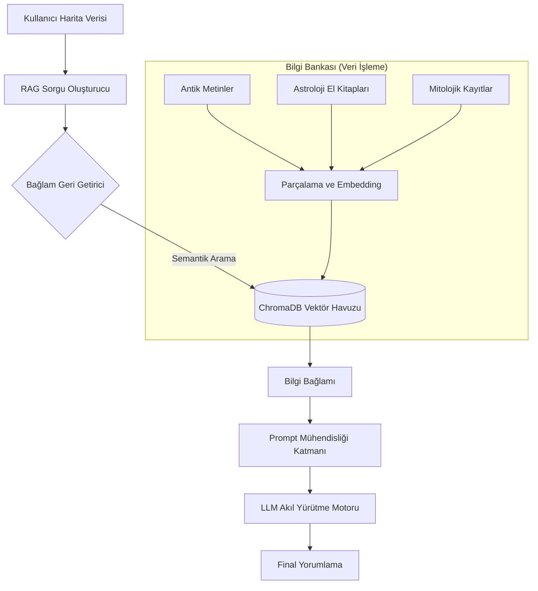

# 🪐 Astro-Oracle: Otonom Gökyüzü Yorumlama Motoru

[](https://opensource.org/licenses/MIT)
[](https://www.python.org/)
[](https://fastapi.tiangolo.com/)
[](https://python.langchain.com/)
[](https://www.trychroma.com/)

**Astro-Oracle**, **Geri Getirme Artırımlı Üretim (RAG)** ve gelişmiş **Büyük Dil Modellerini (LLM)** kullanan kurumsal düzeyde otonom bir gökyüzü yorumlama motorudur. Statik astroloji botlarının aksine Astro-Oracle; antik gök bilimi metinlerini, tarihi el yazmalarını ve çeşitli mitolojik çerçeveleri dinamik ve bağlama duyarlı bir şekilde sentezler.

---

## 🏛️ Sistem Mimarisi

Astro-Oracle, yetkili kaynaklara dayanan yüksek doğruluklu yorumlar sağlamak için çok katmanlı bir RAG boru hattı kullanır.



### Temel Bileşenler
- **`app/main.py`**: Yorumlama istekleri için FastAPI tabanlı REST geçidi.
- **`app/rag_engine.py`**: LangChain, ChromaDB ve LLM sağlayıcıları için entegrasyon katmanı.
- **`app/core/config.py`**: `pydantic-settings` üzerinden merkezi yapılandırma yönetimi.
- **`scripts/ingest_data.py`**: Özyinelemeli doküman dizinleme ve vektörleştirme için özelleşmiş hat.

---

## 🔬 Temel Özellikler

- **Semantik Çok Kaynaklı Sentez**: Batı, Vedik, Helenistik ve Antik Türk (Tengrizm) astronomik perspektiflerinden dinamik bağlam geri getirimi.
- **Agnostik LLM Entegrasyonu**: **OpenAI (GPT-4/Turbo)** ve **Google (Gemini Pro)** için hazır konfigürasyon; yerel modeller (Llama 3/Mistral) ile uyumluluk.
- **Yüksek Yoğunluklu Prompt Mühendisliği**: Analitik, şiirsel ve teknik olarak doğru gökyüzü okumaları için tasarlanmış bağlam zengini istemler.
- **Ölçeklenebilir Doküman Hattı**: Karmaşık PDF ve metin kaynaklarının otomatik olarak yüksek performanslı bir vektör veritabanına dönüştürülmesi.

---

## 🚀 Hızlı Kurulum

### 1. Ortam Yapılandırması
Depoyu klonlayın ve sanal ortamı başlatın:
```bash
git clone https://github.com/arch-yunus/astro-oracle.git
cd astro-oracle
python -m venv venv
source venv/bin/activate  # Windows: venv\Scripts\activate
pip install -r requirements.txt
```

### 2. Gizli Değişkenlerin Yönetimi
`.env` dosyanızı şablon üzerinden yapılandırın:
```bash
cp .env.example .env
# .env dosyasını OPENAI_API_KEY veya GOOGLE_API_KEY ile güncelleyin
```

### 3. Bilgi İşleme (Ingestion)
`app/data/` klasörüne kaynak dokümanlarınızı yerleştirin ve işlemeyi başlatın:
```bash
python scripts/ingest_data.py --source ./app/data
```

### 4. Servisi Başlatma
FastAPI sunucusunu yayına alın:
```bash
uvicorn app.main:app --reload --port 8000
```

---

## 🛰️ API Kullanım Örneği

**Uç Nokta (Endpoint):** `POST /api/v1/interpret/natal`

**İstek Gövdesi (Payload):**
```json
{
  "user_id": "nexus-01",
  "focus_area": "strategic_alignment",
  "chart_data": {
    "sun": {"sign": "Aries", "house": 10},
    "moon": {"sign": "Capricorn", "house": 4},
    "mars": {"sign": "Scorpio", "house": 8}
  }
}
```

---

## 🗺️ Stratejik Yol Haritası

- [x] **Aşama 1**: Temel RAG Hattı ve Vektör Veritabanı Uygulaması.
- [x] **Aşama 2**: Çoklu-LLM Desteği (OpenAI / Gemini).
- [/] **Aşama 3**: Tarihi Türk Astronomi Veri Entegrasyonu.
- [ ] **Aşama 4**: Gerçek Zamanlı Transit İzleme Merkezi (WebSockets).
- [ ] **Aşama 5**: İnteraktif Harita Sentezi (LLM Destekli Sohbet).

---

## 🛡️ Lisans ve Telif Hakkı

**MIT Lisansı** altında dağıtılmaktadır. Daha fazla bilgi için `LICENSE` dosyasına bakınız.
Telif Hakkı (c) 2026 **Astro-Oracle**.
